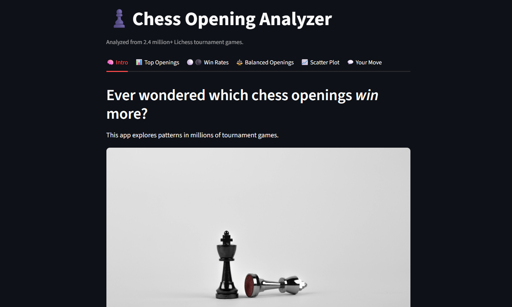

# ♟️ Chess Opening Analyzer

**Explore how the first few moves shape the entire game.**  
This app analyzes 2.4+ million tournament games from Lichess to reveal the most played chess openings, their win rates, balance, and strategic insights — all visualized beautifully.

> “You must study the endgame first.”  
> *But what if we started with the opening?*

---

## 📊 Features

- 📌 **Top 10 Most Played Openings**  
- ⚪⚫ **Win Rate Analysis (White vs Black vs Draw)**  
- ⚖️ **Most Balanced Openings (Low Std Dev)**  
- 📈 **Scatterplot: Popularity vs Balance**  
- 🧠 **Opening picker for personalized insights**  
- Clean visuals built with **Plotly** + **Seaborn**  
- Interactive **Streamlit web app**

---

## 🧠 What You’ll Learn

- Real-world application of **Descriptive Statistics**  
  (Mean, percentage, variance, std dev)  
- Data cleaning + transformation in **Pandas**  
- Visualization using **Matplotlib**, **Seaborn**, **Plotly**  
- Building and deploying a portfolio-ready **Streamlit** app

---

## 📁 Dataset

From [Lichess Tournament Games Dataset](https://www.kaggle.com/datasets/lichess/tournament-chess-games)  
- 2.4M+ rows  
- Extracted `ECO`, `Opening`, `Result` → Derived winner + stats

---

## 🖼️ Screenshots

|  |
|:--:|
| *Top 10 Openings by Popularity* |

---

## 🚀 How to Run

```bash
# Step 1: Clone the repo
git clone https://github.com/Afsheen25/chess-opening-analyzer.git
cd chess-opening-analyzer

# Step 2: Install dependencies
pip install -r requirements.txt

# Step 3: Launch Streamlit app
streamlit run app.py

🧩 Folder Structure
kotlin
Copy
Edit
📦chess-opening-analyzer
 ┣ 📂assets
 ┃ ┗ 📄chess_banner.jpg, style.css
 ┣ 📂data
 ┃ ┗ 📄opening_stats_summary.csv
 ┣ 📄app.py
 ┣ 📄analyzer.py
 ┣ 📄README.md
 ┗ 📄requirements.txt

✨ Credits
Made with ❤️ by Af (Instagram- af.pixelgrain)
Visuals inspired by chess calm, code powered by stats 📊♟️
